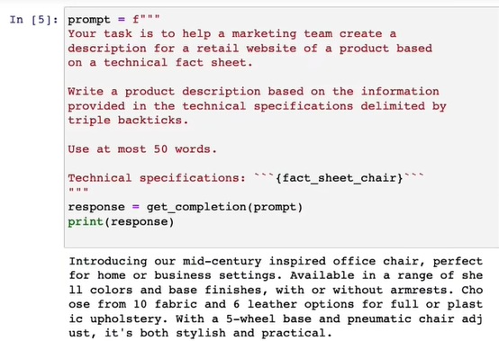
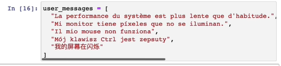
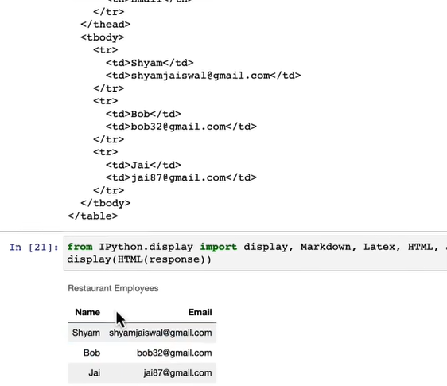
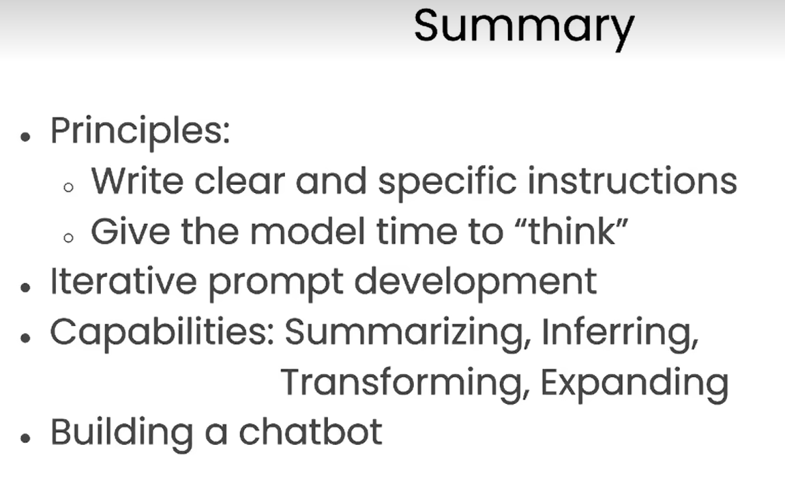

# 吴恩达-Prompt

https://www.bilibili.com/video/BV1No4y1t7Zn

## 概述

有2种LLM的方法，一种是词语接龙，一种是指令调整

对于前者可能接出语料库中似是而非的结果

而后者可以进行指令微调，以及人类反馈RLHF的方式进行训练，这更加有效也可信

## 提示指南

### 原则1-给模型清晰的提示

- 原则1：编写清晰和明确的指令（clear ≠ short）

更长的提示给了更多的清晰度和上下文，可以有更详细的输出

#### 分隔符

> 下面用分隔符可以让GPT知道要对引号里面的进行文字摘要

也能够防止要做摘要文字中有“让其遗忘上文”内容的语句而导致出现问题

#### 结构化输出

比如让其以json形式输出格式，以导入python

#### 模型检查条件

不满足假设，模型停止运行，以防止出错 

用另外一段话，模型从中就没能提出条件

#### 少量训练提示

在模型执行任务之前，提供成功执行任务的示例

下面这句话输出就模仿了我们提供示例的语气

  

### 原则2-给模型思考的时间

让人在极短的时间完成一个复杂的数学问题也会犯错

#### 指定完成任务的步骤

指定了4步，故也输出了4步结果

上面结果已经很好了，但是为了避免上面的法语结果，这里再细化一下格式

 

#### 输出前自行推理

下面这个例子中，我们让模型判断，模型会草草看一下，然后认为学生是对的

然后我们让模型自己算一遍，再来评判

注意：这个输出很不稳定！很多人尝试了，结果不同

### 模型的局限性

#### 模型幻觉

即使训练的时候模型看到了很多知识，但也不代表它都记住了他们，因此它并不是很了解其知识的边界，所以在尝试回答一些晦涩的主题的时候会进行编造（可以看成骄傲的孩子）

以下的案例，模型在胡编乱造，这很危险，因为太逼真了

一种解决方法是让其找到引用，然后可以追溯原文档来减少模型幻觉

## 迭代提示开发

和机器学习过程类似，所以这也是吴恩达没有关注网络上30个完美提示的原因

更重要的是有一个开发适合你的应用程序好提示的过程（继续调参吧！）

经过下面的示例后，我们可以总结出一个gpt工程师不是会写好的prompt，而是会去不断迭代和调试这个过程

### 示例一：椅子说明书

下面这个流程是摘要椅子说明书的任务的不断迭代

发现生成的结果太长了！

长度是52个字符word，大模型在这里有时候不是那么精准

你也可以制定几句话sentence、几百个字符character

希望其描述面向专家，增加专家要求

最后让其增加序号

让其输出时以html格式

返回结果是html

这里尝试展示

## 总结任务

### 单个评论总结

用工具总结冗长的评论，可以设置词语数量

我们可以让gpt给物流团队进行提示，发现已经侧重于提前到达的物流细节

如果让其对定价部门提示，就关注了价格和质量本身

最后可以让它提炼和物流部门的相关信息，而不是去总结它

### 多个评论总结

关于台灯、电动牙刷、搅拌机的3个评论

可以用这个来生成简要的评论

## 文本推理

### 情感分类

评论积极情感

输出一个单词

 

输出情感列表

是被是否生气

### 内容提取

识别购买的商品，和品牌

可以提取多个字段

### 主体判定

一篇文章介绍政府调查，结论是NASA的公众满意度较高

判定是否是以下的主题

生产中我们会将其输出为json，但是这些代码有点脆弱，因为大模型的输出结果可能并不统一

## 文本翻译

一些简单的翻译任务

### 正式场合

也可以跟着情景进行翻译，比如正式和非正式

### 语言识别

可以让GPT识别是什么语言，并翻译

### 语气转换

根据对象不同，产生不同的语气，比如转成不同的信函

### 格式转换

### 拼写检查

非母语时非常有用，但是下面简单调试了一会，其输出结果还是有双引号

还可以前后对比校正的内容

可以转换成APA格式

APA格式（American Psychological Association）是一个为广泛接受的研究论文撰写格式，特别针对[社会科学](https://baike.baidu.com/item/%E7%A4%BE%E4%BC%9A%E7%A7%91%E5%AD%A6/18904321?fromModule=lemma_inlink)领域的研究，规范学术文献的引用和参考文献的撰写方法，以及表格、图表、注脚和附录的编排方式。

正式来说，APA格式指的就是[美国心理学会](https://baike.baidu.com/item/%E7%BE%8E%E5%9B%BD%E5%BF%83%E7%90%86%E5%AD%A6%E4%BC%9A/11012363?fromModule=lemma_inlink)（**A**merican**P**sychological**A**ssociation）出版的《美国心理协会刊物准则》，已出版至第七版、总页数超过400页，[美国心理学会](https://baike.baidu.com/item/%E7%BE%8E%E5%9B%BD%E5%BF%83%E7%90%86%E5%AD%A6%E4%BC%9A/11012363?fromModule=lemma_inlink)是在美国具有权威性的心理学学者组织。APA格式最早出现时只有7页，被刊登在《心理学期刊（Psychological Bulletin）》。

另一种相当有名的[论文格式](https://baike.baidu.com/item/%E8%AE%BA%E6%96%87%E6%A0%BC%E5%BC%8F/5969051?fromModule=lemma_inlink)为[MLA](https://baike.baidu.com/item/MLA/1197673?fromModule=lemma_inlink)格式（The MLA Style Manual），MLA格式主要被应用在[人文学科](https://baike.baidu.com/item/%E4%BA%BA%E6%96%87%E5%AD%A6%E7%A7%91/3705296?fromModule=lemma_inlink)，如文学、[比较文学](https://baike.baidu.com/item/%E6%AF%94%E8%BE%83%E6%96%87%E5%AD%A6/3742?fromModule=lemma_inlink)、文学批评和[文化研究](https://baike.baidu.com/item/%E6%96%87%E5%8C%96%E7%A0%94%E7%A9%B6?fromModule=lemma_inlink)等领域。

## 扩展短文本

可以用于头脑风暴，当然也可以生成大量的垃圾邮件

### 情感回复

下面根据情感去回复，这个情感参数不一定很重要，因为也是从文本中提取的

不同情感回复不同的东西

### 参数响应

用较高的T，每次得到的结果都不同

## AI开发

### 函数介绍

增加一个角色的概念

### 聊天机器人

以下通过系统让助手表现出莎士比亚的风格 

让其表现的像一个聊天机器人

增加上下文

### 订单机器人

先采集用户信息

将订单结果进行json化，这里T设置很低，因为希望不要太随机

## 总结

